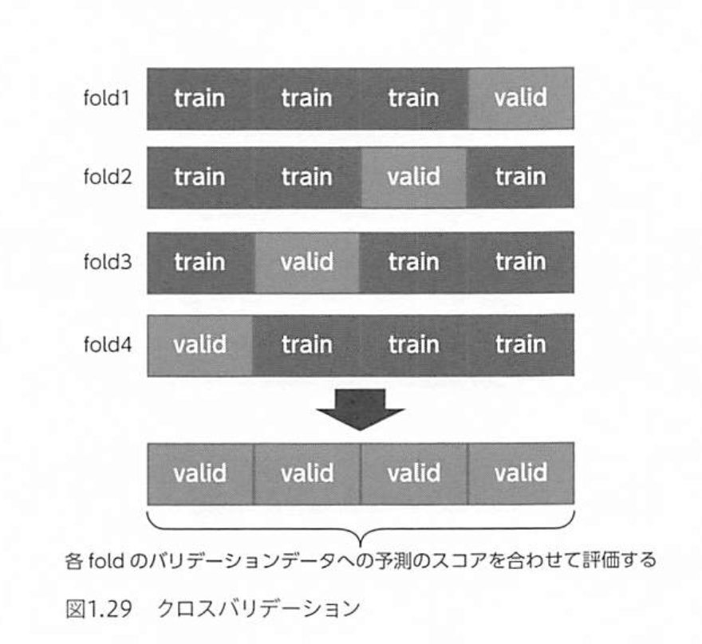

# Kaggleで勝つ データ分析の技術
2019/08での最新VER

テーブルデータを対象とする

- [Code](https://github.com/ghmagazine/kagglebook)

学習データとテストデータを読み込む

```python
train = pd.read_csv('../input/brabra.csv')
test = pd.read_csv('../xxx.csv')

# 学習データを特徴量と目的変数に分ける
train_x = train.drop(['target'], axis=1)
train_y = train['target']

# テストデータは特徴量のみなので、そのまま
test_x = test.copy()
```

学習データを学習データとバリデーションデータに分ける

```python
from sklearn.model_selection import KFold

kf = KFold(n_splits=4, shuffle=True, random_state=71)
tr_idx, va_idx = list(kf.split(train_x))[0]
tr_x, va_x = train_x.iloc[tr_idx], train_x.iloc[va_idx]
tr_y, va_y = train_y.iloc[tr_idx], train_y.iloc[va_idx]
```

[Kaggle API](https://github.com/Kaggle/kaggle-api)なんかも！


### データ理解（EDA）
Exploratory Data Analysis

### GBDT（勾配ブースティング木）
Gradienet Boosting Decision Trees

1. 意味のなさそうなデータを削除
2. 文字列は変換する（label encodingなど）
3. GBDTでは欠損は扱える（補完するのも手ではある）

GBDTのライブラリの1つであるxgboostを使うか、１回




### アンサンブル
単一のモデルでのスコアには限界があっても、複数のモデルを組み合わせて予測することでスコアが向上する場合があり、そのように予測することをアンサンブルと言います。

精度などに応じて、加重平均を撮ったりする

### 分析コンペの流れ
1. 特徴量を作成する
2. 作成した特徴料をそれまでの特徴量に加え、モデルの学習を行う
3. 予測が改善したかどうかをバリデーションで評価する


