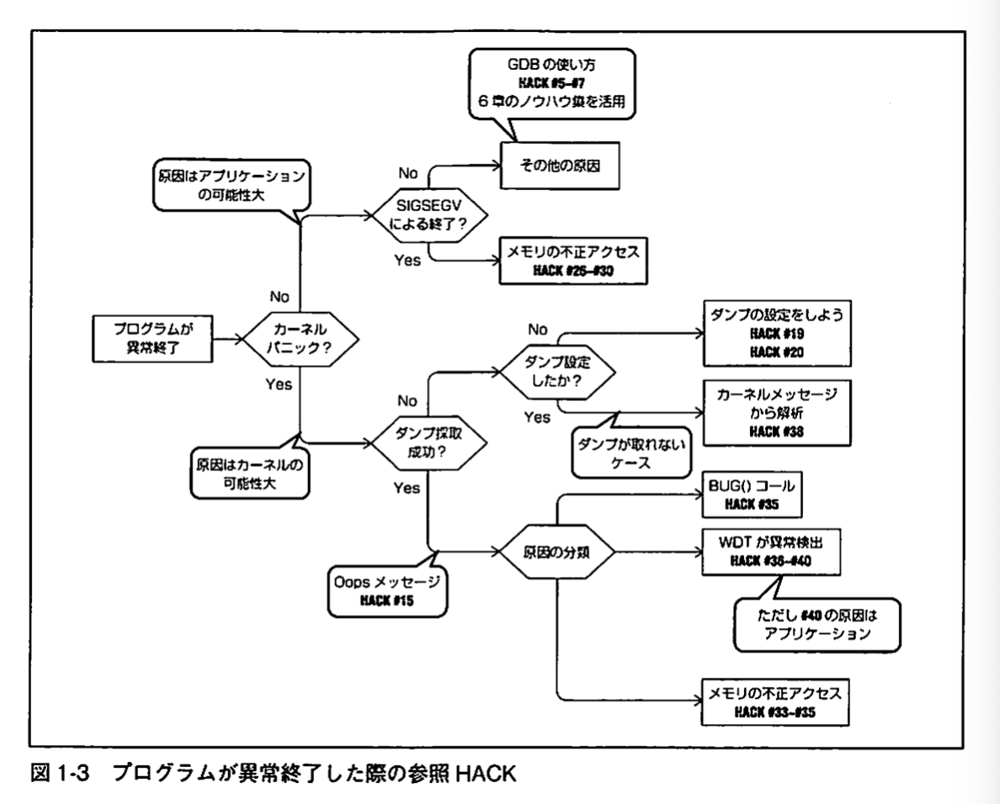
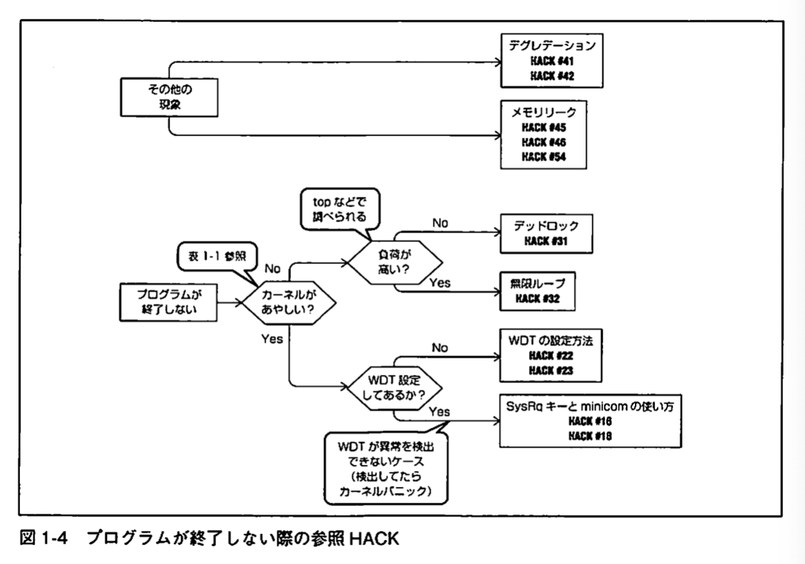

## sec 1
心構え

### デバッグとは
起動できるか確かめた後、テストとデバッグの作業がはじます。

テストというのは、プログラムの動作が使用通りであるかを確認する作業。動作が期待する動作と異なる時、それをバグと呼ぶことにします。テストはプログラムのバグを探すプロセス。

デバッグは、なんらかの方法で発見されたバグを修正するプロセスであり、テストとは全く目的が違う。

バグを見つけたテストのことを、成功したテストという立場がある。

TDDとは、テストとプログラミングそしてデバッグを表裏一体化した開発方法と言える。

### デバッグプロセス
0. テストでバグを見つける！
1. バグの再現
2. デバッグ
3. 動作の確認（テスト）
4. 期待する動作の場合は終了。そうでなければ 2 へ

### Debug Hacks マップ

**カーネルがあやしいと思われる現象**
| 切り分け方法 | 結果 |
| --- | --- |
| ps | 表示が途中で止まる ステータスがD |
| ping | 応答が返らない |
| キーボード | キー入力できない |
| kill -9 | 終了させられない |
| strace | アタッチできない |
| gdb | アタッチできない |
| カーネルメッセージを見る | softlockupなどの出力 |

### 心得

#### 再現させる前の心得
環境構築：バグが発生した環境と揃える。ハードウェアもソフトウエアも！

例：パラーメタオプション、NIC、H/Wメーカー、設定ファイル

#### 再現させた後の心得
- 現象の確認。
  - 再現したものが本当に本当に同じ現象か確認する。
- 再現率、時間の確認

#### 解析時における心得
- 現象を目で確認
- できるだけ範囲を狭める
- バージョンによる問題の切り分け

#### 問題の原因が不明であるときの心得
- ハードウェアを疑う
- 過去にあった同じようなバグの修正を見つける

