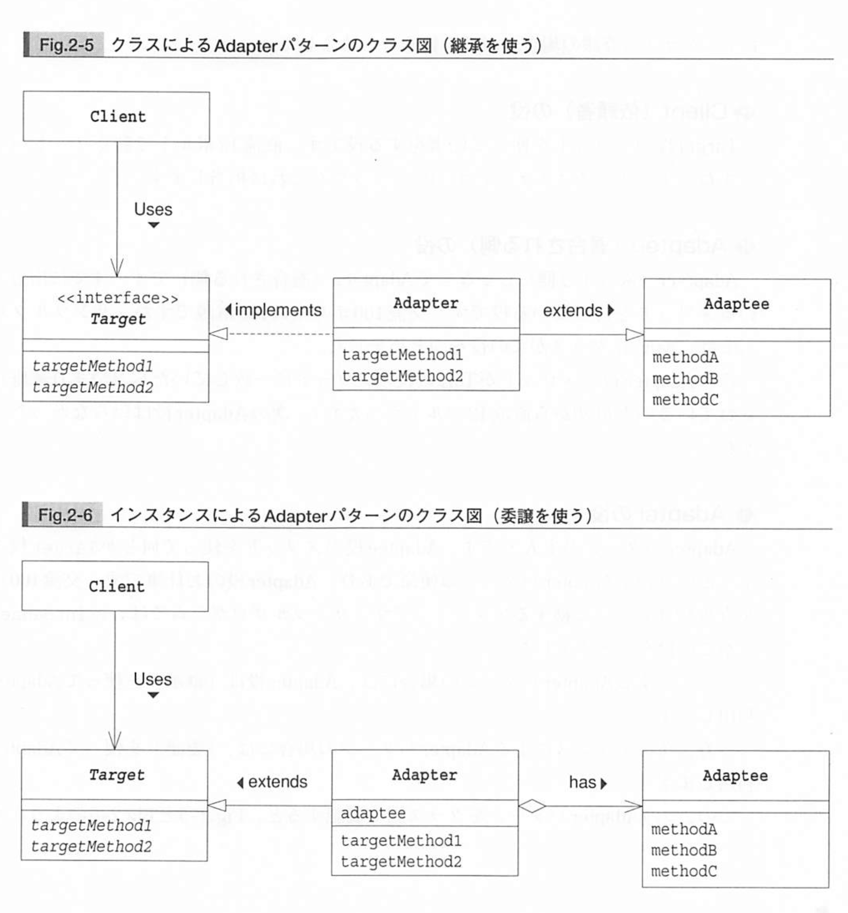

# Adapter
- 一皮かぶせて再利用
- AC アダプターのような役割。
- すでに提供されているものがそのまま使えないときに、必要な形に変換してから利用する。
- Adapter パターンは Wrapper パターンと呼ばれることもある。
- 次の2種類がある
  - クラスによる Adapter パターン（継承を利用）
  - インスタンスによる Adapter パターン（委譲を利用）

## 継承を使ったもの

```plantuml
@startuml
Main --> Print: Uses >
Print <- PrintBanner
PrintBanner -> Banner

class Main {

}
Interface Print {
  {method} printWeak
  {method} printStrong
}
class PrintBanner {
  {method} printWeak
  {method} printStrong
}
class Banner {
  {method} showWithParen
  {method} showWithAster
}
@enduml
```

```java
// Banner.java
public class Banner {
    private String string;
    public Banner(String string) {
        this.string = string;
    }
    public void showWithParen() {
        System.out.println("(" + string + ")")
    }
    public void showWithAster() {
        system.out.println("*(*" + string + "*")
    }
}

// Print.java
public interface Print {
    public abstract void printWeak();
    public abstract void printStrong();
}
```

以下の PrintBanner クラスが、アダプターの役割を果たす。用意されている Banner クラスを拡張（extends）して、showWidhParen メソッドと showWithAster メソッドを継承する。

```java
public class PrintBanner extends Banner implements Print {
    public PrintBanner(String string) {
        super(string);
    }
    public void printStrong() {
        showWithAster();
    }
    public void printWeak() {
        showWithParen();
    }
}
```

そして、main では、以下のように PrintBanner のインスタンスを Print インタフェース型の変数に代入して使える！！！

```java
public class Main {
    public static void main(String[] args) {
        Print p = new PrintBanner("Hello");
        p.printWeak();
        p.printStrong();
    }
}
```

PrintBanner クラスがどういうふうに実現されているかを Main クラスは知らずに使えている。


## 委譲を使ったもの
今度は「インスタンスによる」Adapter パターンを見てみる。

委譲とは、誰かにお任せする、と言うこと。Java においては、あるメソッドの実際の処理を他のインスタンスのメソッドに任せてしまうことをいう。

上でのフォルダにおいて、Print がインターフェースではなく、クラスとしようという試み。

ところが、Java では、2つのクラスを同時に継承することはできない（単一継承）。

先程の例では、自分のスーパークラスから継承した showWithParen, showWithAster メソッドを呼んでいたが、今度はフィールド経由で呼び出してみる。


```plantuml
@startuml
Main --> Print: Uses >
Print <|- PrintBanner
PrintBanner o-> Banner

class Main {

}
Interface Print {
  {method} printWeak
  {method} printStrong
}
class PrintBanner {
  {method} printWeak
  {method} printStrong
}
class Banner {
  {method} showWithParen
  {method} showWithAster
}
@enduml
```

```java
// Print.java
public abstract class Print {
    public abstract void printWeak();
    public abstract void printStrong();
}

// PrintBanner.java
public class PrintBanner extends Print {
    private Banner banner;
    public PrintBanner(String string) {
        this.banner = new Banner(string);
    }
    public void printWeak() {
        banner.showWithParen();
    }
    public void printStrong() {
        banner.showWithAster();
    }
}
```

## Adapter パターンの登場人物

- Target(対象)の役
  - Print クラス
  - ノートパソコンを動かすための直流１２ボルト
- Client(依頼者)の役
  - Main クラス
  - 直流１２ボルトで動くノートパソコン
- Adaptee(適合される側)の役
  - Banner クラス
  - 交流１００ボルトの AC 電源
- Adapter(適合する人)の役
  - PrintBanner クラス
  - Adaptee 役のメソッドを使ってなんとか Target 役を満たそうというのが、このクラスの使命！
  - 交流１００ボルトを直流１２ボルトに変換するアダプター



```java
// FileIO.java
import java.io.*;

public interface FileIO {
    public void readFromFile(String filename) throws IOException;
    public void writeToFile(String filename) throws IOException;
    public void setValue(String key, String value);
    public String getValue(String key);
}

// FileProperties.java
import java.io.*;
import java.util.*;

public class FileProperties extends Properties implements FileIO {
    public void readFromFile(String filename) throws IOException {
        load(new FileInputStream(filename));
    }
    public void writeToFile(String filename) throws IOException {
        store(new FileOutputStream(filename), "written by FileProperties");
    }
    public void setValue(String key, String value) {
        setProperty(key, value);
    }
    public String getValue(String key) {
        return getProperty(key, "");
    }
}
```
