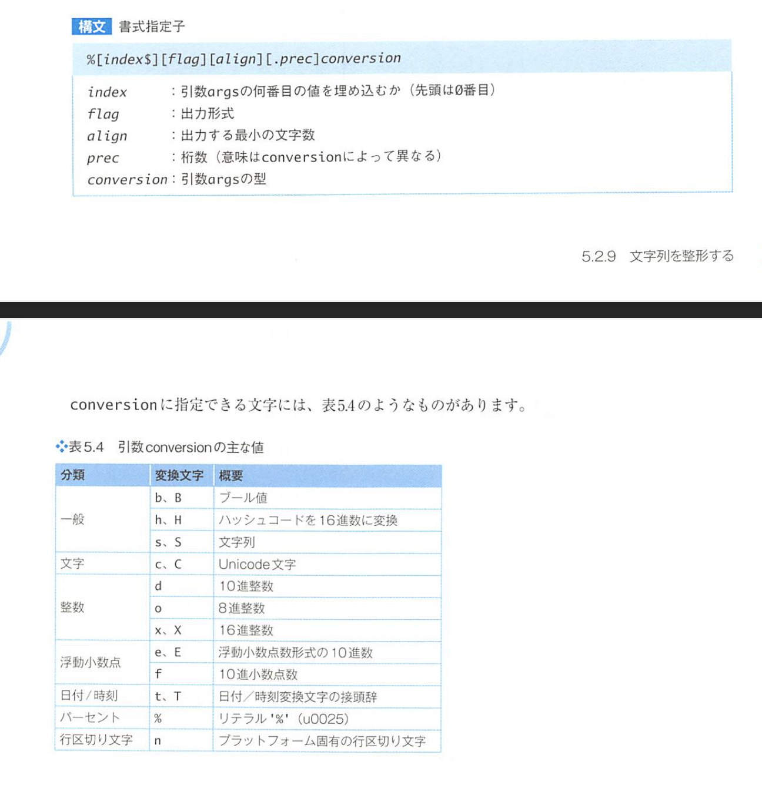
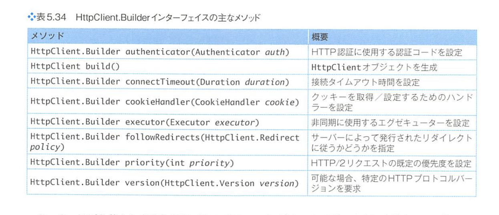
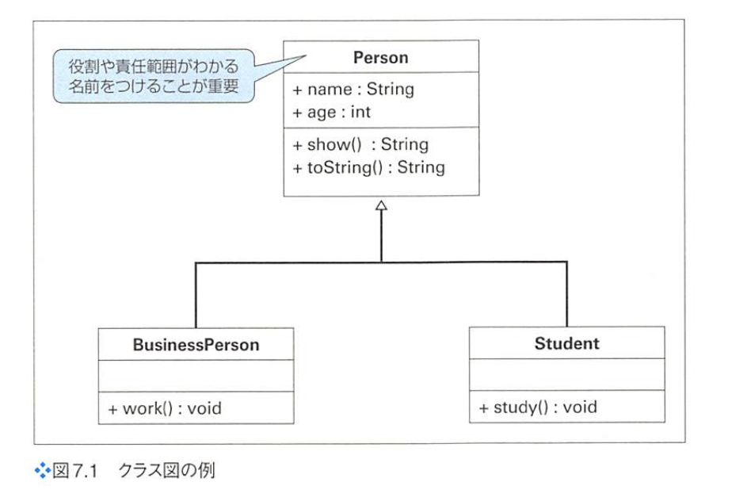
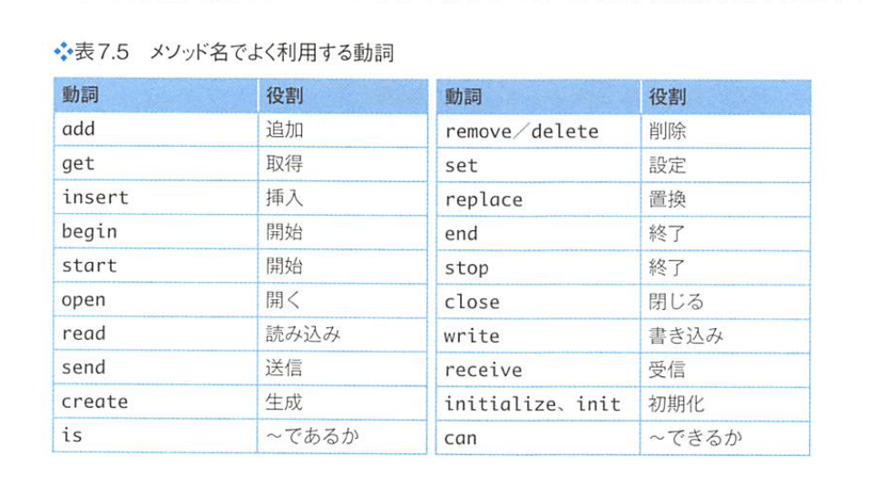
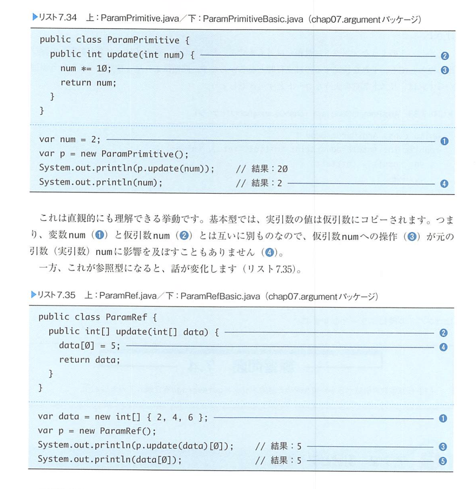
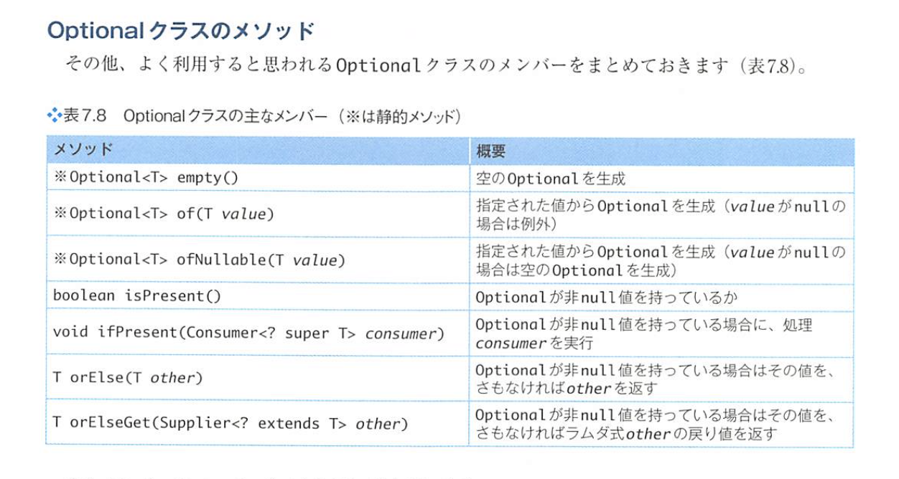

## sec 1

### Java とは

- オブジェクト指向
- Java仮想マシン
- ガベージコレクション

### Java仮想マシン
Javaは、Java仮想マシンと呼ばれるソフトウェアの上で動作します。

従来の、例えばCのような言語は、コードをそれぞれのプラットフォームが理解できる言語ーマシン語に変換してから実行していました。（コンパイル）

マシン語はそれぞれプラットフォームに固有のものなので、例えばWindows環境に対応したアプリをLinux、macOSなど他の環境で実行することはできません。

Javaでも同じく、コードを実行するためにコンパイルという手順を経ますが、その出力はマシン語ではなく、Javaバイトコードと呼ばれる、Java仮想マシンが解釈できる形式となる。よって、Javaでは個々のプラットフォームに応じて実行ファイルを準備する必要はない

Write once, Run anywhere

### ガベージコレクション（GC)
プログラムが確保したメモリ領域のうち、利用されなくなったものを自動的に解釈する機能のこと

### class
Javaではファイルもクラスと対応関係になければならない。つまり、HelloクラスはHello.Javaというファイルで定義する必要がある

class {...} 配下に含まれる要素のことをメンバーと呼ぶ。メンバーには、フィールド、メソッド、コンストラクターなど、さまざまな要素がある。

Java ではメインメソッドは特別な意味を持ち、エントリーポイントと言う。

### ドキュメンテーションコメント（/**...*/）
後でドキュメントの生成に利用できるコメント

@author 作者名 のように、「@...」形式のタグで付加情報を列挙していくのが基本

### 記法
- 変数は camelCase
- クラスは Pascal
- 定数は、アンダースコア記法、USER_NAME

### データ
- マジックナンバーをなくす
- 定数の利用
  - final 修飾子により**再代入できなく**なる

```java
final double TAX = 1.08;
```

- 基本型と参照型のデータ型がある
  - 基本型はプリミティブ型とも呼ばれる
  - Javaにとっては参照型の方が基本
  - プリミティブ型の例
    - byte, short, int, long, float, double, boolean, char
- 浮動小数点の内部形式
  - IEEE 754 規格
  - 符号(1bit)指数(8bit)と仮数(23bit)
  - 仮数は１以上２未満


- 文字型
  - **単一の**文字を表す型
    - 複数の文字は String（参照型）
  - Unicode(UTF-16)
- 真偽型
  - 整数値と相互変換できない
  - true/false
- 型推論
  - var キーワードを利用することで、変数を宣言する際にデータ型を省略できるようになった
    - `var i = 108;`
  - ローカル定数でしか使えない
- リテラル
  - リテラルとは、データ型に格納できる値そのもの。また、値の表現方法のこと。
  - 浮動小数点リテラル
    - 指数表現が可能
- 型サフィックス
  - `System.out.println(2158765456L)`
    - L: long型にすることで、明示的にロング型にしてる
- 数値セパレーター
  - `var value = 1_234_567`
- 文字リテラル
  - ''でくくる
  - 文字列ではないので、文字1つのみ
  - 'あ', '\u3042'
- 文字列リテラル
  - ""でくくる
- キャスト
  - 広い型から狭い型への代入は、明示的に変換（キャスト）が必要
- 参照型
  - クラス型
  - インターフェイス型
  - 配列型
- クラス型
  - クラスをインスタンス化するには、new というキーワードを利用
  - オブジェクトを生成せずに、クラスから直接呼び出せる、クラスフィールド/クラスメソッドなるものもある
- null 型
  - 参照型では、変数がオブジェクトへの参照を持たない状態を表す特別な値として、null がある。
- 配列
  - 宣言
    - `int[] list = new int[5]`
    - `int[] list = {1,2,3,4,5}`
  - 配列は、newによってインスタンス化される一種のオブジェクト
    - よって、lengthのようなフィールドにアクセスできる
  - 多次元配列
    - `int[][] list = new int[4][5]`

## sec 3
メモリの再割り当ては、それなりにオーバーヘッドの大きな処理なので、あらかじめ文字量が想定できているならば、インスタンス化の際にサイズを明示しておく。

`var builder = new StringBuilder(1000)`

前置演算子、後置演算子

```java
var i = 3;
var j = ++i;
System.out.println(i); // 4
System.out.println(j); // 4

var m = 3;
var n = m++;
System.out.println(m); // 4
System.out.println(n); // 3
```

浮動小数店の演算に注意

```java
System.out.println(Math.floor((0.7 + 0.1) * 10)); // 7

// 対策
import java.math.BigDecimal;
var bd1 = new BigDecimal("0.7");
var bd2 = new BigDecimal("0.1");
var bd3 = new BigDecimal("10");
System.out.println(bd1.add(bd2).multiply(bd3)) // 8
```

- 同一性（Identity）と同値性（Equivalence）
  - 同一性：オブジェクト参照同士が同じオブジェクトを参照していること
  - 同値性：オブジェクトが同じ値を持っていること

```java
var builder1 = new StringBuilder("あいう");
var builder2 = new StringBuilder("あいう");
// == 演算子は、同一性を比較
System.out.println(builder1 == builder2); //false
// equals メソッドは、同値性を比較するツール

```

javaの論理演算において、「&&」は短絡評価を行うが、「&」は行わない！

## sec 4
swich のフォールスルーに注意

文字列連結のように、無意識にオブジェクトを生成するような状況には、パフォーマンス面で要注意。

try-catch: の try ブロックへの移動も、相当のオーバーヘッドがかかる。ループ内での利用は注意


## sec 5
標準で利用できる数多くのクラス群（標準ライブラリ）

- ラッパークラス
  - 基本型をオブジェクトとして扱うためのクラス群
  - 単なる値に過ぎない基本型のデータを包んで、オブジェクトとしての機能を付与するためのクラス
  - メモリ消費量が大きいので、なるべく控える
- 文字列の操作：String クラス
  - 内部的に String クラスのインスタンスを生成している
  - 文字列リテラルでインスタンスを生成するのが基本
  - `var str = new String("ai")`は、２回インスタンスを作っていることになる...
  - length()
    - サロゲートペアの扱いには注意
  - codePointCount(0, str.length())
  - isEmpty()
    - `"  "` return false
  - isBlank()
    - `"  "` returns true
    - \t, \n, \r, \f also return true
  - strip()
    - stripLeading()
    - stripTrailing()
  - indexOf(str)
    - lastIndexOf(str)
    - indexOf(str, startIndex)
    - returns -1 if not match
  - contains
    - startsWith
    - endsWith
  - substring(begin, end)
  ```java
  var mail = "yamada@example.com";
  var domain = mail.substring(mail.lastIndexOf("@") + 1);
  ```
  - charAt(index)
  - split(separator)
  - join(separator, elems)
  - format(brabra)
    - 書式指定子と呼ばれるプレイスホルダー



- 日付/時間: Date-Time API
  
### Stream
- Fileの読み書きは、途中で処理がこけてもちゃんとファイルを閉じれるようにする（そうしないと、プログラムがファイルを所有してしまって、他のプログラムからアクセスできない）
- Java では、ストリーム（Stream）という仕組みを利用して、入出力処理を実施する。
- 入力ストリーム、出力ストリーム
- 文字ストリーム、バイナリストリーム
- シリアライズ
  - オブジェクトのような構造体データをバイト配列に変換すること
- Files クラス
- HttpClient クラス
  - java.net.http モジュールに属するクラス
  - module-info.java を変更する必要がある＠＠

```java
var client = HttpClient.newHttpClient();
var req = HttpRequest.newBuilder()
  .uri(URI.create("https://codezine.jp"))
  .build();
var res = client.send(req, HttpResponse.BodyHandlers.ofString());
System.out.println(res.body());
```



## sec 6

コレクションフレームワーク

コレクションとは、モノ（オブジェクト）の集合を表す仕組みです。

java.util パッケージは、コレクションを扱うための汎用的なクラス/インターフェイスの集合。これを総称して、コレクションフレームワークと呼ぶ。

それぞれのインターフェイスには、次のような実装クラスが用意されている。


コレクションのインスタンス化

`インターフェイス型<要素型> = new 実装クラス型<>(引数, ...)`

`List<String> data = new ArrayList<>();`

変数の方として、（実装型ではなく）インターフェイス型を用いているのは、実装（クラス）への依存を最小限に抑えるため！

一般的に、コレクションを扱う際に受け取り側のメソッドにとって関心があるのは、（実装ではなく）振る舞いーコレクションが提供するメソッド！インターフェイス型を利用するということは、メソッドが振る舞いにしか興味がないことを明示的に意思表示することとなり、開発者が意識しなければならないことを最小限に抑えられている。

### ジェネリクス構文
ジェネリクス（Generics）とは、汎用的なクラス/メソッドを特定の方にひもづけるための仕組み。`List<String>`のように、本来の汎用型（ここではList）に対して、`<...>`の形式で個別の型（ここではString）を割り当てることで、文字列を格納するための専用リストになる

非ジェネリクスなコレクションでは、全ての要素はObject型とみなされ、値を取り出す際には明示的な型キャストが必要となる。

ジェネリクスによってコレクションが型安全になる

コレクションの要素型には任意の参照型が指定できる。基本型は不可能（`List<int>`は使用できない、`List<Integer>`のようにラッパークラスで代用）

### 配列との比較？
オブジェクトの集合を扱う場合、まずは配列よりもコレクションを利用すべき！

配列は機能にも乏しく、オブジェクト指向構文との親和性にも欠けるから。

- 配列 → リスト
  - Arrays.asList()
- コレクション ⇨ 配列
  - toArray([T[] a])

### 特殊なコレクション
- 変更不能コレクション
  - unmodifiableXxxx メソッド
- 同期化コレクション
  - スレッドセーフに利用できるようになる

### リスト
リストは、配列のように配下の要素が順序づけられたコレクション。

ArrayListは、内部的には配列を利用したデータ構造。ただし、配列とは異なり、あとからでもサイズを変更できる。

### そのほか
- Set
- Map
- Stack(LIFO)
  - Undo
- queue(FIFO)
  - 待ち行列

## sec 7
オブジェクト指向構文

Javaの基本はクラス。



class名は、Pascal記法（Upper CamelCase (UCC)）で統一

よく利用される接頭辞/接尾辞

| 接頭辞/接尾辞 | 概要 |
| --- | --- |
| AbstractXxxx | 抽象クラス |
| XxxxxException | 例外クラス |
| XxxxFormatter | フォーマッター |
| XxxxLogger | ログクラス |
| XxxxTest | テストクラス |

- 下位クラスはより具体的に
  - Readerクラスの派生クラスとして、FileReader/BufferedReader/PipedReader

### 修飾子
トップレベルで定義した class 命令で利用できる就職し

| 修飾子 | 概要 |
| --- | --- |
| public | 全てのクラスからアクセス可能 |
| final | 継承を許可しない |
| abstract | 抽象クラス |
| strictfp | 浮動小数点数を環境に依存しない方法で演算 |

一般に、浮動小数点数の計算は重い処理であり、JavaではCPUに委ねている。このため、32bit,64bitなどの環境の違いにより、演算結果に差異が出る場合がある。

### フィールド
フィールドは、class {...}の直下で定義された変数。メンバー変数とも呼ばれ、クラスで管理すべき情報を表す。

- 先頭に修飾子を付与できる
- varキーワードは利用でき**ない**

フィールドで利用できる主な修飾子

| 修飾子 | 概要 |
| --- | --- |
| public | 全てのクラスからアクセス可能 |
| protected | 現在のクラスと派生クラス、同じパッケージのクラスからのみアクセス可能 |
| private | 現在のクラスからのみアクセス可能 |
| static | クラスフィールドを宣言 |
| final | 再代入を禁止 |
| transient | シリアライズの対象から除去 |
| volatile | 値のキャッシュを制御 |

アクセ雨修飾子を省略した場合、private がデフォルトとなる！！えf

### 既定値
メソッドの中で宣言された変数（ローカル変数）と、フィールドとで異なる点が、もう一点ある。それは、ローカル変数が既定値を持たないのに対して、フィールドにはある！

| データ型 | 既定値 |
| --- | --- |
| boolean | false |
| byte, short, int, long | 0 |
| float, double | 0.0 |
| char | \u0000 |
| 参照型 | null |

### メソッド
- メソッド名は「動詞＋名詞」の形式で命名するとよい



メソッド修飾子

| 修飾子 | 概要 |
| --- | --- |
| public | 全てのクラスからアクセス可能 |
| protected | 現在のクラスと派生クラス、同じパッケージのクラスからのみアクセス可能 |
| private | 現在のクラスからのみアクセス可能 |
| static | クラスメソッドを宣言 |
| abstract | 抽象メソッドを宣言 |
| final | オーバーライドできないようにする |
| synchronized | 1つのスレッドからのみアクセス可能 |
| strictfp | 浮動小数点数を環境に依存しない方法で演算 |
| native | Java以外の言語で記述されたメソッド |

- 修飾子の記述順
  - public
  - protected
  - private
  - abstract
  - static
  - final
  - transient
  - volatile
  - synchronized
  - native
  - strictfp

### メソッドのオーバーロード
名前、引数の型/並び からなるメソッドの識別情報のことをシグニチャという。例えば「indexOf(String, int)」

**引数の**型/並びが異なっていれば、同じ名前のメソッドも定義可能

### スコープ
- フィールドのスコープ
- ローカル変数のスコープ
- ブロックスコープ

### コンストラクタ
- public, protected, private 修飾子のみ
- 戻り値は持たない
- 名前はクラス名と一致させる

```java
public class MyClass {
  public MyClass(String name) {
    this.name = name;
  }
}
```

コンストラクタもメソッドと同じくオーバーロードできる！？！？！

以下のようにデフォルト引数として利用する？

```java
public class Person {
  public String name;
  public int age;

  public Person(String name, int age){
    this.name = name;
    this.age = age;
  }
  public Person(){
    this("名無権兵衛", 120);
    // Do something
  }
}
```

### 初期化ブロック
class {...}の直下に書かれた名無しのブロックは、インスタンスかのタイミングでコンストラクターよりも先に実行される。！

```java
public class Person {
  ...
  // 初期化ブロック
  {
    this.updated = LocalDateTime.now();
  }

  public Person(...){
    ...
  }
}
```

### ファクトリーメソッド
コンストラクターはインスタンスを生成するための代表的な手段であるが、唯一の手段ではない。

このようなインスタンス生成を目的としたメソッドをファクトリーメソッドという。

```java
public class FactoryClass {
  private FactoryClass(){...}

  // ファクトリーメソッド
  public static FactoryClass getInstance() {
    return new FactoryClass();
  }
}
```

メリット

- 自由に命名できる
- インスタンスを常に生成しなくても良い
  - シングルトンパターン
    - GoFの1つ
- 戻り値の型を抽象型/インターフェイス型にもできる

### ユーティリティクラス
クラスメンバーしか持たない

インスタンス化は不要で、無駄なインスタンスだけ生成できてしまう状態はむしろ有害！

そのような場合には、コンストラクターをprivate化することで、そのクラスのインスタンス化を禁止できる！（コンストラクターを外から呼び出せない（private）＝インスタンス化できない）

```java
public final class Math {
  private Math() {
    ...
  }
}
```

なお、ユーティリティクラスは、finalで修飾しておくのが一般的。

### クラス定数
static final

### 引数に注意


参照型では、

> （値そのものではなく）値を格納したメモリ上の場所を格納している

からこのような現象が起こる

### null 安全の対策
- Optional クラス
  - nullチェックを簡単かし、NullPointExceptionを防ぐための（null安全のための）クラス

```java
import java.util.Optinal;

public Optional<String> getTitleByIsbn(String isbn) {
  return Optional.ofNullable(this.data.get(isbn));
}
```



### パッケージ
名前を分類するための仕組み

パッケージは、いうならば、クラス/インターフェイスなどの所属。Listだけでは一意にならない（かもしれない）名前も、java.utilパッケージに属するListとすることで、名前の衝突を回避できる

名前空間まで加味した「java.util.List」のような名前を、**完全修飾名**という。


