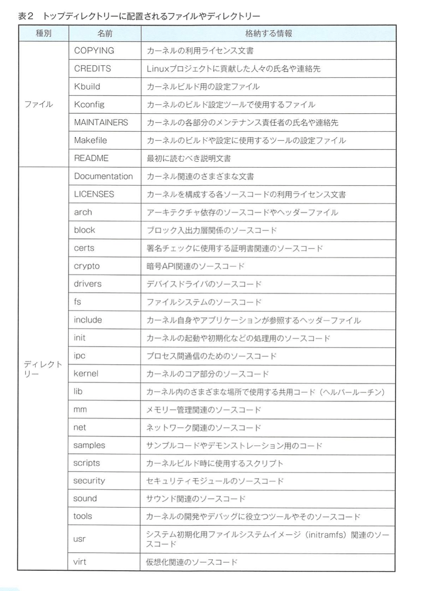

# 各セクションメモ

## sec1

### 1.1
Kernel: 植物の種子の内部にある「仁」を表す英単語

linuxのカーネルは、ファイルシステムやデバイスドライバなども包含していて、担当する機能の範囲が比較的広い


安全性やセキュリティ、メンテナンス性などの向上を狙って、カーネルが担当する機能を極端に少なくしたOSもある。そのOSのカーネルは「マイクロカーネル」と呼ばれる。

アプリケーションがカーネル配下の機能を使ったり、ハードウェア資源を操作する場合には、「システムコール」と呼ばれる仕組みを使ってカーネルに処理を依頼する

Linuxカーネルの機能面での最大の特徴は、提供するシステムコールがUNIXというOSと、ほぼ共通であること。

アプリケーションの互換性を保つための標準化の動き「POSIX」

```sh
$ man syscalls
```

Linuxはカーネルの名称

### 1.3
カーネルはイベント駆動型

イベントとして３つ

- ハードウェア割り込み（外部割り込み）
- ソフトウェア割り込み（内部割り込み）
- システムコール

### 1.4 タスク管理の仕組み
Linuxでプログラムを実行すると「プロセス」または「スレッド」が作成される

- プロセスとは、主にメモリーに読み込まれ、独立したメモリー空間を割り当てられて稼働中のプログラムのこと
- スレッドとは、他のプロセスやスレッドとメモリー空間を共有する特殊なプロセスのこと

CFSというタスクスケジューラを採用している

### 1.5 メモリ管理
仮想アドレス空間と物理アドレス空間のマッピング方法、Linuxでは「ページング」を採用

ページ回収処理

1. ページキャッシュに利用している物理ページの内容を破棄する
2. 無名ページのデータを「スワップ領域」に書き出す（スワップアウト）

無名ページとは、「ファイルと関連づけられていないページ」のこと

ページ回収処理でも追いつかない場合、「OOM Killer」(Out of Memory Killer)と呼ばれる処理を開始する

### 1.6 デバイス管理
全てのデバイスを「ファイル」として抽象化している

デバイスファイルという（/dev）

デバイスの２分類

- キャラクター型
  - シリアル回線や端末
  - データを１バイトずつ入出力する
- ブロック型
  - 固定長のデータ単位に入出力する
  - データは基本的にバッファーされる

### 1.7 ファイルシステム
- 記憶装置の種類の違いを意識しなくて済む
- ファイルの管理性の向上
- 記録データのセキュリティの確保


### 1.8 ネットワーク
通信プロトコルに柔軟に対応するために「ソケット」が作られた


## sec2

### 2.1 モジュールとは
Linuxカーネルは、カーネル空間と呼ばれる特別なメモリー空間に配置されて稼働する巨大なプログラム

5.4系のカーネルでは、圧縮カーネルファイルのサイズは125Mバイトにもなる。これはデカすぎ

あまり使わないものはモジュールとして切り出しておき、必要な時のみ用いる形にする。そうすることで、12Mバイトまで小さくなる！＠

### 2.2 モジュールの格納先
`/lib/modules/カーネルのリリース番号`

現在稼働中のカーネルのリリース番号は、`uname -r`でわかる

### 2.3 コマンドでモジュールを管理する
主なコマンド

```sh
# 依存関係データベースファイルの更新
$ sudo depmod -a
# モジュール情報の一覧表示
$ lsmod
# モジュール情報の表示
$ modinfo lp

# 依存関係を考慮したモジュールの組み込み
$ sudo modprobe lp
# 依存関係を考慮したモジュールの取り外し
$ sudo modprobe -r lp
# モジュールの取り外し
$ sudo rmmod lp
```


## sec3

### 3.1 
ソースコードのままでは稼働できず、稼働させるには、システムアーキテクチャに合わせたバイナリー形式に変換する必要がある。この変換作業のことを「ビルド」と呼ぶ

### 3.3
stableカーネルの中から、長期間メンテナンスをする「longterm」カーネルが年に一つ程度の感覚で選出される。

```sh
$ mkdir tmp
$ cd tmp
$ wget https://mirrors.edge.kernel.org/pub/linux/kernel/v5.x/linux-5.10.30.tar.xz
$ tar xvf linux-5.10.30.tar.xz
```



## sec4
