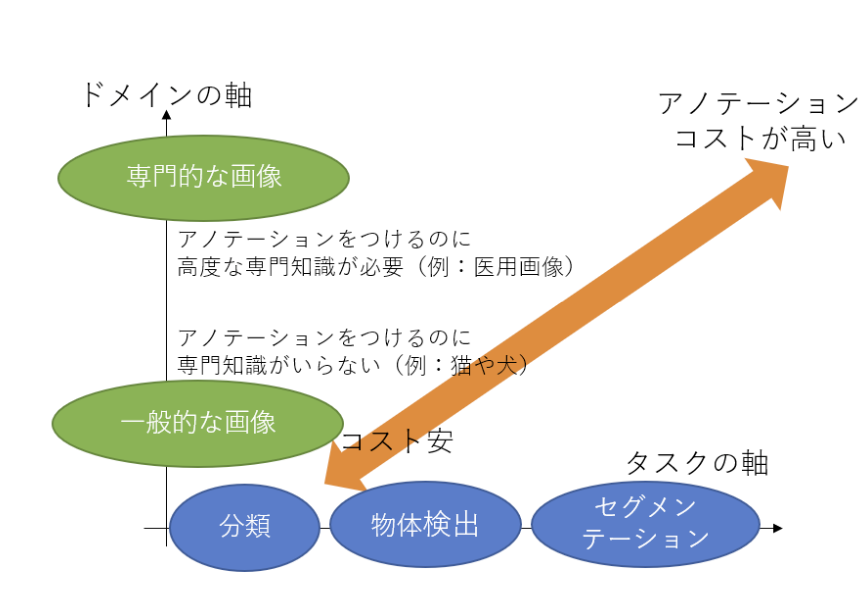

## sec 5
OPY データセット

Inpainting, CVPR, ECCV, ICCV

### 脱いでいた方が簡単
顔やおっぱいなどは、「少ない主成分で情報の大半を説明できる」という性質があるため、モザイク除去は行いやすい。

### Bounding Box
検出領域を四角形で囲んだもの、これを物体検知の用語では**Bounding Box**という。「左上の点のxy座標、右下の点のxy座標」からなる。

データの作成とは、各画像に対してBounding Boxをつける作業である。これにはアノテーションツールという専用のソフトを使う。（VoTT, Labelbox, Labelimg）

### アノテーションのコストを考える
DLもとい、MLのデータ作成で大事になるポイントはアノテーションのコストである。**１枚の画像に対する正解（Bounding Boxなど）を入力するのにどれくらいの時間がかかるのか**という問題

アノテーションコストを考える上で、**タスクの軸とドメインの軸**の２つが考えられる



### データを作ることから逃げない
MLや特にDLの性能の向上とは、ほぼほぼ訓練データの数に比例する。

[Train with 1000](http://www.ok.sc.e.titech.ac.jp/~mtanaka/proj/train1000/)という、訓練データを1000個に絞ってどれだけ精度が出るかを試すプロジェクトがある。これを見ると、どれだけ**データの量が大事**かがわかるだろう

#### データの量と精度（感覚値）
データ数と精度は対数関数的な関係がありそう。つまり、1000枚→１万枚と、１万枚→１０万枚の精度向上の度合いはほぼ同じ。

これに対し、アノテーションのコストは線形なので、どこかで最適な絵画存在するはず。

#### 大量すぎても問題ない？
- 訓練が大変になり、試行錯誤をするのが難しくなる
- **そもそもデータから答えを推論するのが困難なケースでは、データを増やしても意味がない**
  - サイコロの次のめやコイントスの結果を予測するなど
  - 人間が予測できるか、で判断したら良い

> データ数が多くなると訓練が大変になる。最初から巨大なデータを作るのではなく、小さなデータを作ってそれで試行錯誤して、最後に大きなデータを作ると良さそう

### 自作データセットの柔軟性

- タスクのミスマッチを防げる
- デー卓レイジングの点

### データの作成方針

#### Pixivpy
Pixivからイラストのダウンロードができる

```
pip install pixivpy --upgrade
```


