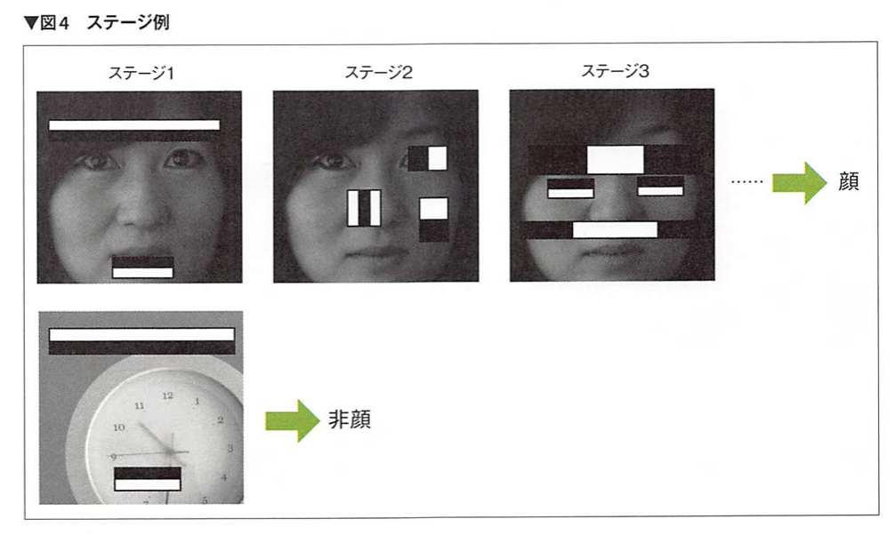
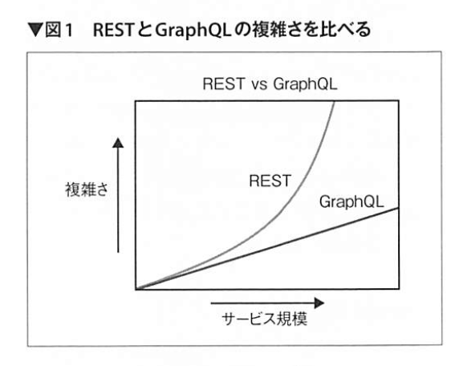

# Software design 2021-08

## Raspberry PiでエッジAI

### Haar Cascade
- Raspberry Piでも比較的高速に動作させることができる顔検出技術
- Raspberry PiでGPUやTPUといったアクセラ レータを使わずにエッジAIの処理をさせるときは、リアルタイムの必要がない単なる顔の検出といった用途では精度が若干高いHOG特徴を使用し、検出した顔の種別に応じた処理をリアルタイムに実施する必要があるときにはHaarCascadeを使用するのが適している？？
- Haar-like特徴量





Qt（キュート）とは、クロスプラットフォームアプリケーションフレームワークである
VNCはVirtual Network Computing

## git
- git rebase -i HEAD^3
- git rebase --abort


## React

### WHY React?
- 仮想DOMと宣言的UIの成果
- 宣言的UI（HTMLのような：対義語は命令的（JS））であるのにもかかわらず、更新速度が高速に行えている点がすごい
- UIを全てJSの力で描画する
- Webの構成要素は「DOM」という、オブジェクト指向のデータモデル
- ヘッドレスCMS?
- むしろHTMLがDOMもどきだったのかと感じるようになる

### JSX
- Reactアプリを書くうえで用いる記法
- JS内にHTML的な記法で「DOMの設計図」を書けるようにするための言語拡張


### hook
- useState
  - useHogeHoge
  - 関数に変数を記憶させる
- 兄弟間などでデータをやり取りしたりすることが多いなら、一番上位のコンポーネントでカウントを保持するstateを作るのも手
  - Reactのデータは、常に上のコンポーネントから下へと流れる

### Flux
- Facebookが提唱している、jsのデータの流れをわかりやすく整理するためのアーキテクチャ
- 単方向データフロー
- Redux
  - Fluxの派生
  - Single Source of Truth

### パフォーマンス
- 描画と読み込みの2つに大別


## GraphQL
- Web API上で動くクエリ言語とエンジンの仕様
- 単一のエンドポイントで必要な情報をとってくる
- 新しいWebAPIのスタイル
- Twitter, GitHub, Airbnb, Uber, Netflix, Shopify
- 有名なGraphQLクライアント
  - Relay, Apollo, urql..
  - 状態管理も行える
- ライブラリ
  - graphql-js, express-graphql, Apollo Server
- [GitHub API v4](https://docs.github.com/ja/graphql/overview)

### cf. REST API
- シンプルで使いやすい設計ができる
- エンドポイントベースのAPI
  - HTTPと相性が良い
- 課題
  - オーバーフェッチやアンダーフェッチが発生する

### モダンなWebの問題点
- クライアントの多種多様なユースケース
- サービス全体にまたがる複数のデータとその組み合わせが膨大
- 単一のエンドポイントだけでは必要なデータが足りない！
  - 異なるエンドポイントに対し複数のリクエストが必要に！
- 最悪のが愛N＋1のリクエスト（アンダーフェッチ問題）
- 極意粒のデータのために通信を行う（オーバーフェッチ問題）
- シンプルなデータモデル・シンプルな実装をしたいREST vs 多種多様なデータをすくないリクエストで取得したいモダンなWebアプリケーション

### 次のようなAPIが必要
- クライアントのユースケースに柔軟に対応、かつ低遅延
- サーバ側の実装負担が大きくならない
- サービスが拡大しても指数関数的に管理コストが増えない
  
> GraphQLの出番

### GraphQLの特徴
- クエリ言語：クライアント自身が作成
  - ユースケースに相当
- 型システムとスキーマ：事前に行うデータモデリング
- 検索エンジン：ビジネスロジックの呼び出しと結果の解決

### データフェッチ
- **クライアント自身**が単一のエンドポイント(/graphql)に対してリクエストボディにGraphQLのクエリ言語を記述し、POSTリクエストを行う
- クライアントは一度のリクエストで必要なデータを受け取ることができるため、オーバーフェッチやアンダーフェッチの問題を解決する
- クエリは階層構造
  - レスポンスも階層構造
  - Webアプリケーションのような階層構造のUIとよく合う
  - クライアントは取得したデータを変換することなくそのまま利用できる！！

### スキーマ
- 1つのスキーマに全てのデータとそのかたを表現する
- スキーマそれ自体がAPIドキュメントである！
  - 実装にあたり、認識のずれが生じない！



### エラーハンドリング
- GraphQLはアプリケーション層のプロトコルのため、GraphQL over HTTPの場合、実行でエラーが発生した場合でも全て「ステータスコード 200 OK」が返る

### 公開APIとセキュリティ
- クライアントからの悪意のあるクエリに備える必要がある！
  - クライアントサイドでクエリを生成するため
- GraphQLを発明したFacebookでも 公開APIはRESTで提供している

### GitHub API v4
- [explorer](https://docs.github.com/ja/graphql/overview/explorer)

```
query { 
  viewer { 
    login
  }
}
```

Organizationとリポジトリの情報を取得するクエリ

```
query organizationWithRepositories {
  organization(login: "apollographql") {
    name
    location
    url
    websiteUrl
    repositories(first: 5) {
      totalCount
      nodes {
        name
        pullRequests {
          totalCount
        }
        issues {
          totalCount
        }
      }
    }
  }
}
```

```
{
  user(login: "kokoichi206") {
    id
    email
    name
    url
    repositories {
      totalCount
      totalDiskUsage
    }
  }
}
```


### クエリ言語
- トップレベル
  - Query: 取得系
  - Mutation: 更新系
  - Subscription: サーバープッシュ型のリアルタイム通信

