## GANs
- GANsは教師なしに属する
    - 生成モデリング

## 数学
- GANs では確率変数が生成されるターゲット
- データが従う確率分布 p そのものはわからないので、生成器の確率分布で近似する
    - 学習では、確率分布を近づけることとなる
- pGをprに近づけるための指標として、KL divergence と JS divergence


### Binary Cross Entropy


なぜ、これで実装するのか


## 実装方針

### 生成器
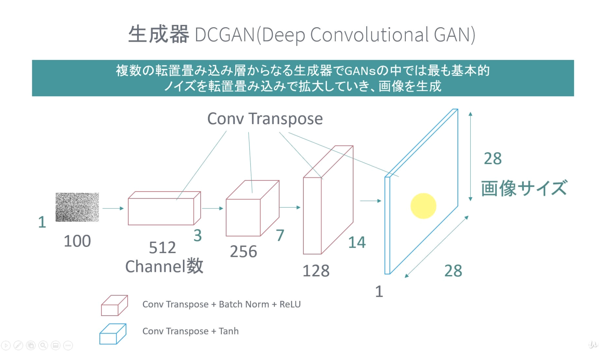

入力の次元は別に１００じゃなくても良い

#### 転置畳み込み層


画素値をカーネルで重みづけて、周りに派生させていく。

### 識別器
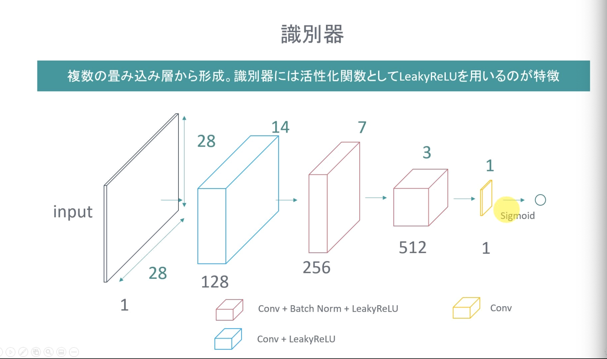

複数の畳み込みから構成

誤差をしっかり伝播させたいので、LeakyReLU

### 損失関数
Min-Max GAN: 

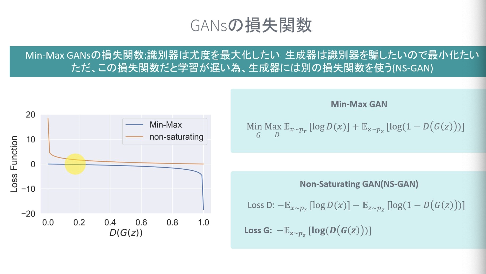


## Conditional GAN
COnditional GAN は、ノイズや画像にラベルを付与することで、特定の画像を生成することができる！

100次元のノイズ＋One hot vector 10次元（ここでは、0-9 の数字の分類に使うので、10次元の One hot vector）

画像に対してラベルを付与する場合は、チャネル方向に追加する。
モノクロに対しては、1次元＋10次元 ⇨ １１チャネルになる

## GANs の課題

### 安定した訓練や判断が難しい
- 生成器と識別器のバランスが崩れるとうまく学習できない
    - 識別器が強すぎる場合には生成器が騙せなくなり、勾配消失が起こる
- モード崩壊
    - 騙しやすい画像が見つかるとそればかり生成するようになり、多様性がなくなる
- 訓練をやめるタイミング
    - 損失関数の値と画像のクオリティが必ずしも相関してない ⇨ いつ訓練を止めるべきか
    - 識別器も更新されていくため

### 訓練プロセスの課題
- モデルを変えると安定して訓練できない
    - DCGAN, Batch Normalization 有無とか

### Wasserstein GAN: WGAN
訓練の安定か/判断を解決するために、Wasserstein-GANが提案された

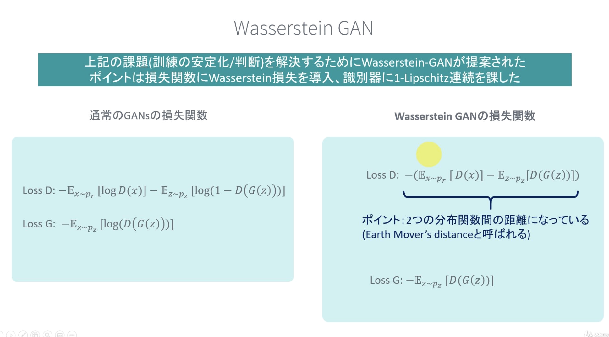

#### 1-Lipscitz 連続を課す２つの方法
1. Weight Clipping
    * Weight をある値の範囲(-c,c)でクリップする
    * クリップ範囲 c をうまく決める必要がある
1. Gradient Penalty
    * 勾配が１になるような正則化項を追加する

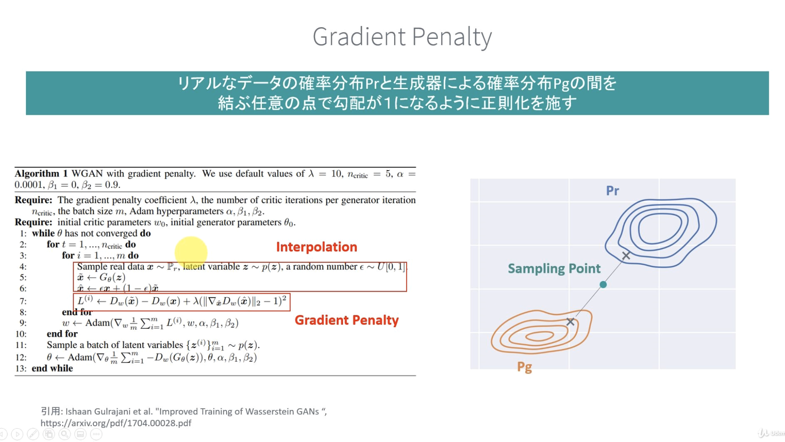

#### それ以外の訓練場の工夫
- 生成器と識別器の訓練回数を 1:n_critic にして識別器を多く訓練する
- オプティマイザに RMSProp を使う
- 論文では n_critic に５を与えている
- 生成器の誤差逆伝播は識別器を通って伝搬
    - 識別器が未熟だと真偽の判断がいい加減になるので、上手くフィードバックされない

#### WGAN のメリット
- 損失関数と画像のクオリティの相関があり、解釈がしやすい
- 訓練プロセスが安定する
- モデルや訓練画像の変化に対してロバスト

#### GP: Gradient Penalty
BN は当てないほうがいい。

そもそも、Discriminator の１層目は、なんで最初から BN False にしてたんだっけ？

### Gradient Penalty Loss
``` python
def gradient_penalty(real_imgs, fake_imgs, gp_weight, netD, device):
    batch_size = real_imgs.size()[0]
    alpha = torch.rand(batch_size, 1, 1, 1)
    alpha = alpha.expand_as(real_imgs).to(device)
    fake_imgs = fake_imgs.to(device)
    interpolated_imgs = (alpha * real_imgs.data + (1 - alpha) * fake_imgs.data).requires_grad_()
    interpolated_out = netD(interpolated_imgs)
    grad_outputs = torch.ones(interpolated_out.size()).to(device)
    gradients = torch.autograd.grad(interpolated_out, interpolated_imgs,
                                    grad_outputs=grad_outputs,
                                    create_graph=True, retain_graph=True)[0]
    gradients = gradients.view(batch_size, -1)
    eps = 1e-12
    gradient_norm = torch.sqrt(torch.sum(gradients ** 2, dim=1) + eps)
    gp = gp_weight * ((gradient_norm - 1) ** 2).mean()
    return gp
```

使い方

``` python
lossD_gp = gradient_penalty(real_imgs, fake_imgs, opt.gp_weight, netD, device)
lossD = lossD_real + lossD_fake + lossD_gp
lossD.backward()
optimizerD.step()
```

学習のスピードはゆっくり！


## Cycle GAN
- ２組の画像セットを互いに変換できる GAN
- A -> B へ変換する GAN と B -> A へと変換する GAN を同時に訓練する

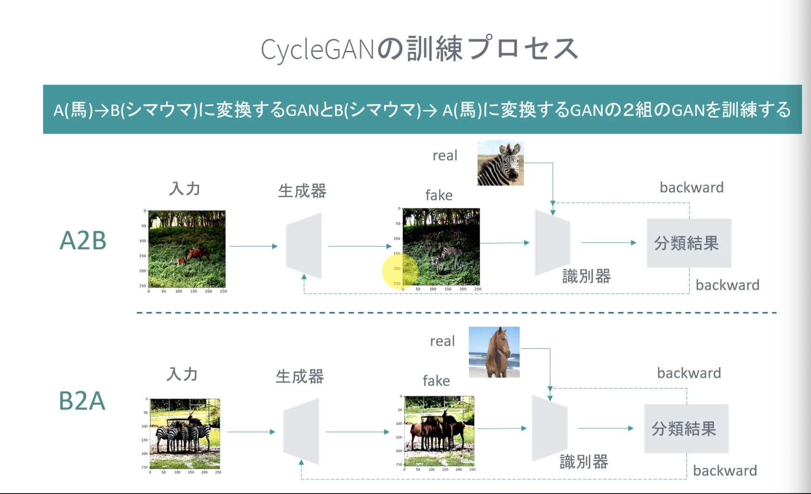

### 生成器
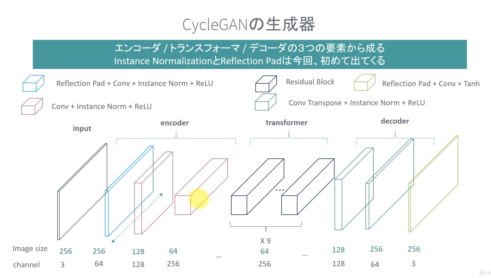

#### Instance Normalization
BN では、ミニバッチと画像全体にわたって、入力の正規化を行っていた。
Instance Normalization では、画像全体のみで正規化を行う。ミニバッチサイズ=1 のBNと同じ！

#### Reflection Pad
- ゼロパディングとは異なりエッジ部分を鏡映面として反映させたパディング方法
- 単純にゼロパディングするとエッジでは明らかにパターンが失われるが、折り返して繋げることで画像の中のパターンをエッジ周辺でも保つ！

#### Loss Func
- 敵対性損失 + サイクル一貫性損失 + 同一性損失の３つの項からなる
- 識別器は通常のGANと同じく敵対製損失のみ
- サイクル一貫性損失
    - A -> B -> A の変換で元に戻りたいよね？
- 同一性損失
    - 馬の画像を F に与えた時に、馬のままになっているかどうか
    - 経験的にこの損失を入れたほうが変換がうまくいく！


### 識別器
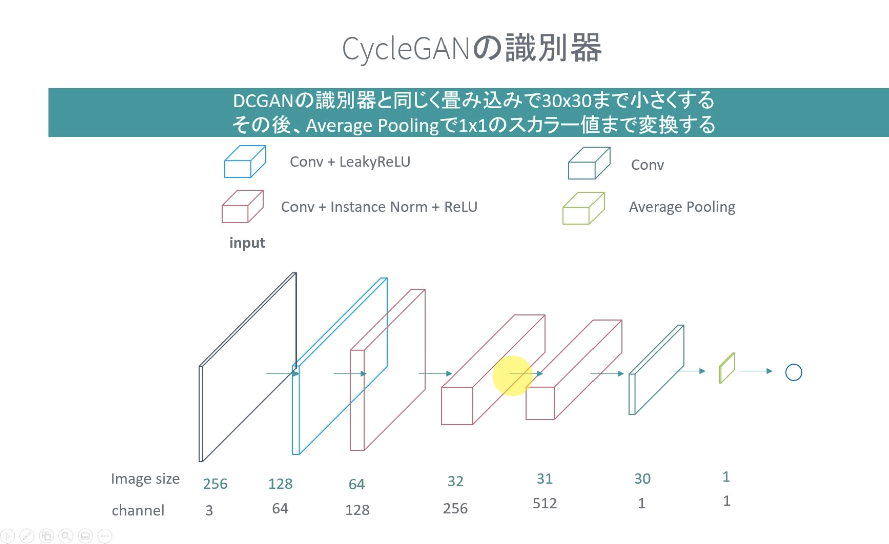


### 補足
- ミニバッチ数は１
- スケジューリング
    - 学習率を途中から変化させる（途中から減らしていく）
- Replay Buffer
    - CycleGAN では学習中の損失の振動を抑えるために最新の Fake 画像を判別する代わりに過去 50 枚のバッファー画像から１枚を取り出して損失を計算する
- [馬としまうまのデータセット](https://people.eecs.berkeley.edu/~taesung_park/CycleGAN/datasets/)


## Self-Attention GAN

### 畳み込みの問題点
畳み込みはカーネルを通してパターンを拾う or 表現する

転置畳み込みで画像を拡大するときは**局所的なパターンのつなぎ合わせ**で全体を表現する。

> 複数のカーネルをまたぐ Long-range のパターンは苦手！

### Self-Attention の導入
SA-GAN では自分のピクセルと似ている部分を特徴料として抽出する Self-Attention を導入

右目に対して左目の位置など**ピクセル的には少し離れている大域的な特徴**を拾うことができる

### SA の計算
大まかに２ステップ。

1. 畳み込みでチャネル数を圧縮する
1. attention マップを作成

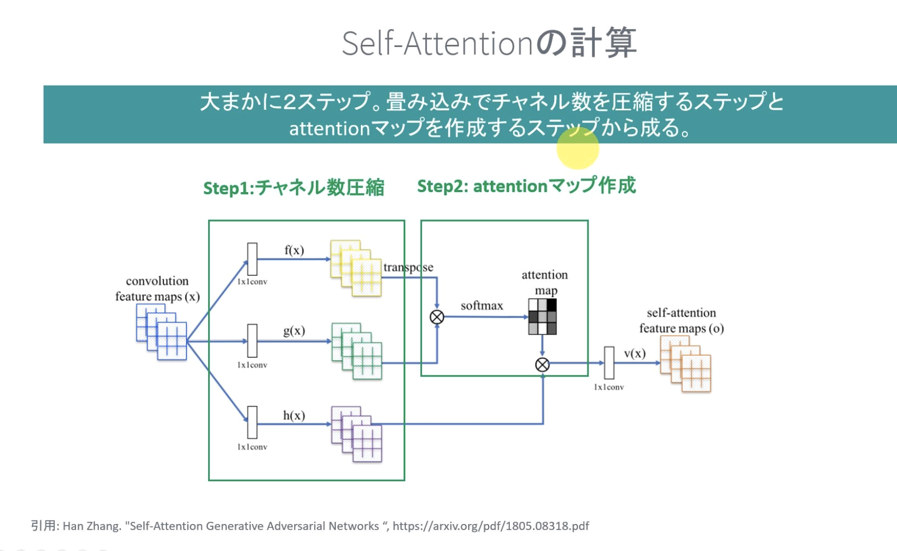

### Step1:Pointwise Convolution
(1*1) Pointwise Operation

Self-Attention マップは非常にメモリを食うため、あらかじめチャネル数を圧縮しておく

### Step2:Attention Map
Attention Map とはピクセル毎に相関を計算した行列。

まずは画像を一次元化し、転置したベクトルとの行列席を計算する

### Attention Layer
元の画像に Attention Map を足し算として、特徴量とする。

Attention Map はピクセルの相関を計算しているため、似ているところが入力で重みづけられる

### Spectral Normalization
1-Lipscitz 連続を課すための方法の１つ

Weight を正則化する

固有値の最大値で規格化しておくと、一番大きな値でも１になるため、出力値が極端にならない（Spectral Normalization）の考え方

1. 行列の特異値（固有値）を求める
1. 特異値の最大値（行列のスペクトル半径）で重み付けパラメーターを規格化する

### ネットワーク
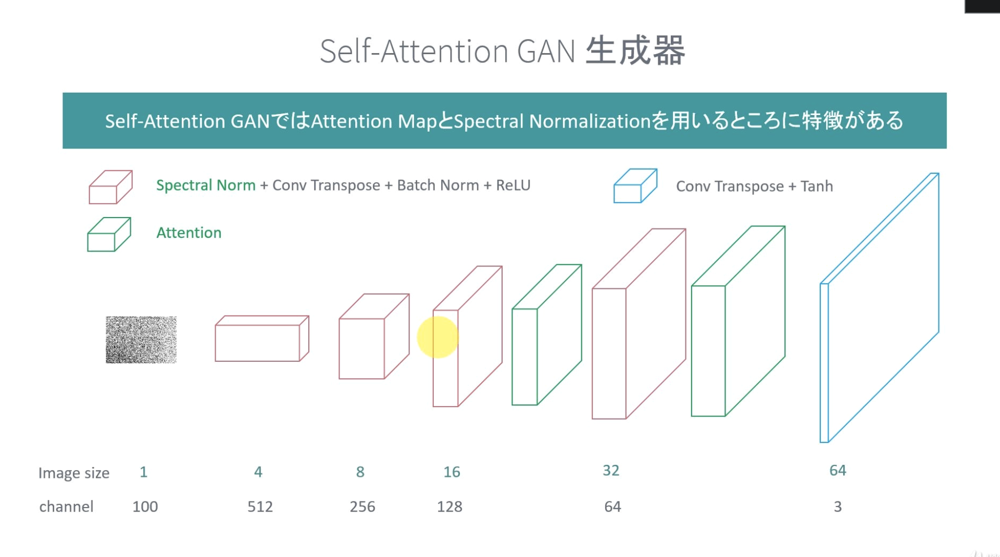

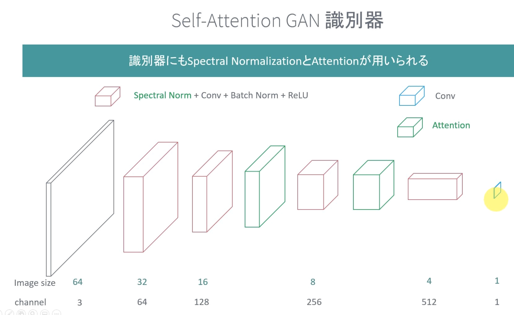

### 訓練の工夫展

#### TTUR
Two-Timescale Update Rule

識別器と生成器で異なる学習率を使うこと。

識別器の学習率 4e-4, 生成器の学習率 1e-4 とすることで、識別器を速く訓練する

### dataset
[Oxford 102 Flowers](https://www.robots.ox.ac.uk/~vgg/data/flowers/102/)

### Loss Func
Self-Attention GAN では、損失関数に **Hinge 損失**という関数を用いる。

なぜなーら、GANの安定な訓練に寄与するから！

## Memo
``` python
layers = [nn.utils.spectral_norm(nn.Conv2d(in_channels, out_channels, kernel_size, stride, padding))]
```

ここがどういう処理辿ってるかわからん。。。


### Links
- [さまざまなGAN](https://ai-scholar.tech/articles/treatise/gansurvey-ai-371)
